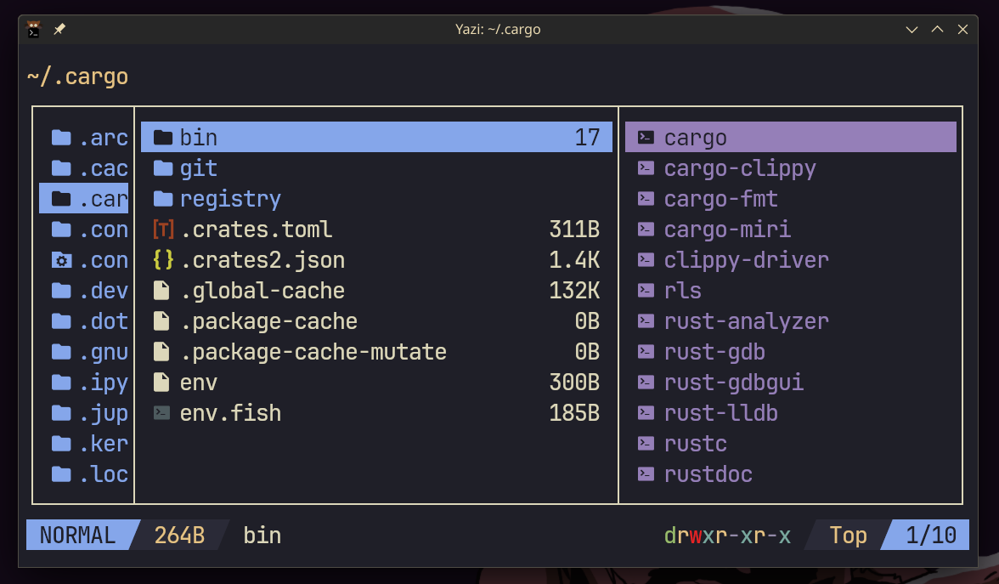

<div align="center">
  
</div>

<h3 align="center">
    Line - simple statusline plugin for <a href="https://github.com/sxyazi/yazi">Yazi</a>
</h3>

## 👀 Preview



## 🎨 Installation

```bash
ya pack -a dangooddd/line
```

## ⚙️ Usage

Add these lines to your `init.lua` configuration file to use it:

```lua
require("line"):setup()
```

Configuration options:
```lua
require("line"):setup({
    -- mode names to display in statusline
    mode = {
        normal = "NORMAL",
        select = "SELECT",
        unset = "UNSET"
    },
    -- lualine style separators between sections
    separators = {
        left = "",
        right = ""
    }
})
```

This plugin will use colors specified in theme.toml, check \[mode\] section.

## 📜 License

This plugin is MIT-licensed.

Check the [LICENSE](LICENSE) file for more details.
